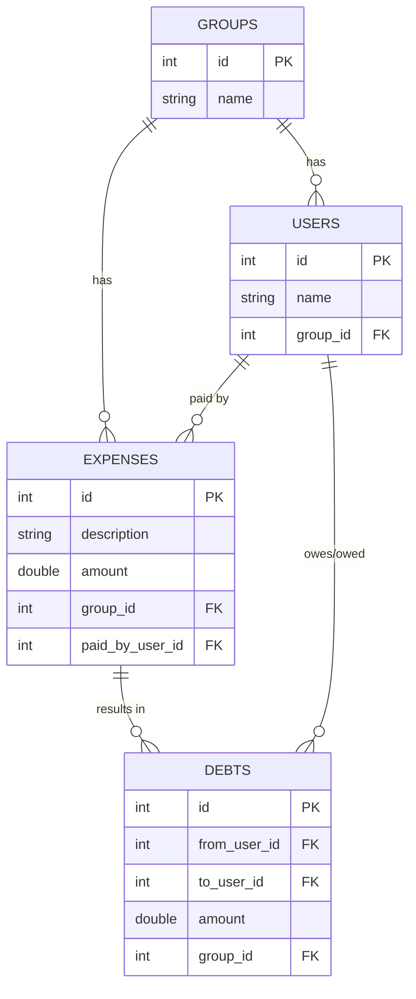
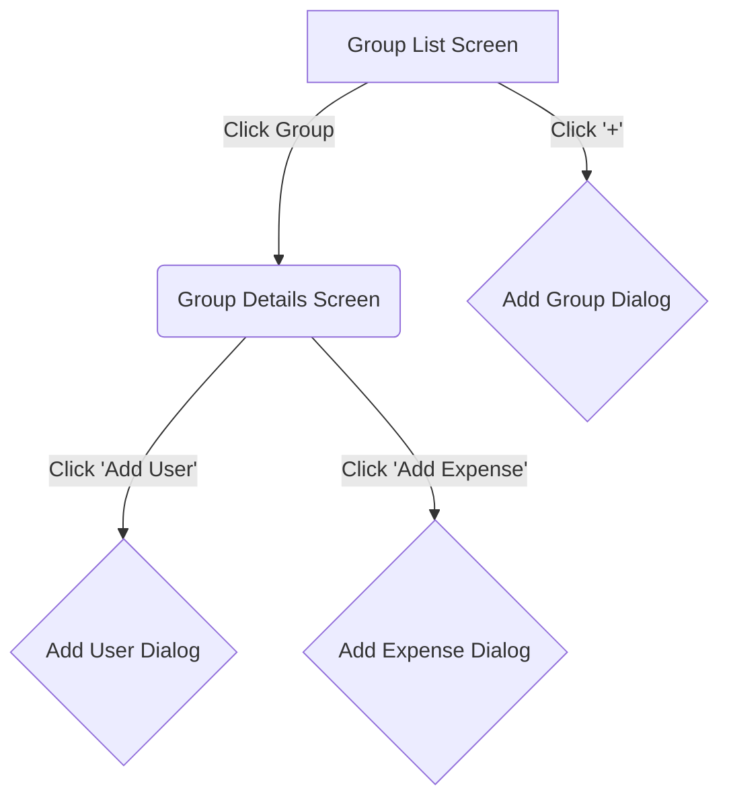
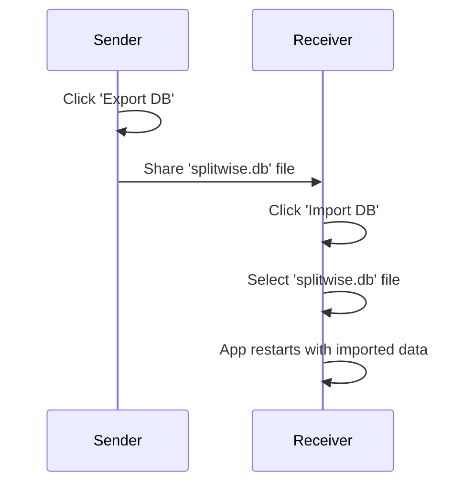

# Splitwise Free - README

This document provides a comprehensive overview of the Splitwise Free Android application, including its technical design, the decisions made during its development, and detailed instructions on how to build and run the application from the command line.

## Project Overview

Splitwise Free is a proof-of-concept Android application that replicates the core functionality of Splitwise. It allows users to manage shared expenses within groups, track balances, and synchronize data between devices using a simple peer-to-peer mechanism.

## Features

*   **Group Management:** Create and manage groups of users.
*   **User Management:** Add users to groups.
*   **Expense Tracking:** Add expenses to groups, with the cost split equally among all group members.
*   **Balance Viewing:** View the balances of who owes whom within a group.
*   **Peer-to-Peer Synchronization:** Export and import the application's database to manually synchronize data between devices.

## Technical Design and Decisions

### Architecture

The application follows the **Model-View-ViewModel (MVVM)** architecture, which is the recommended architecture for modern Android applications. This architecture separates the UI from the business logic, making the application more modular, testable, and maintainable.

*   **Model:** The Model consists of the data layer, which includes the Room database, DAOs (Data Access Objects), and the `SplitwiseRepository`. It is responsible for managing the application's data.
*   **View:** The View is implemented using Jetpack Compose. It is responsible for displaying the data to the user and capturing user input.
*   **ViewModel:** The `SplitwiseViewModel` acts as a bridge between the Model and the View. It exposes the data from the repository to the UI and contains the business logic for processing user input.

### Technology Stack

*   **Kotlin:** The application is written entirely in Kotlin, Google's recommended programming language for Android development. Kotlin's modern features, such as coroutines and null safety, help to write concise, safe, and asynchronous code.
*   **Jetpack Compose:** The UI is built using Jetpack Compose, Android's modern toolkit for building native UI. Compose allows for a declarative approach to UI development, which makes it easier to build and maintain complex UIs.
*   **Room Persistence Library:** Room is used for local data storage. It provides an abstraction layer over SQLite, which simplifies database access and ensures compile-time verification of SQL queries.
*   **Kotlin Coroutines and Flow:** Asynchronous operations, such as database access, are handled using Kotlin Coroutines and Flow. This ensures that the main thread is not blocked and the UI remains responsive.

### Database Schema

The database schema is designed to store groups, users, expenses, and debts.



### User Interface Flow

The user interface is designed to be simple and intuitive.



## Building and Running the Application

You can build and run the application from the command line without needing Android Studio.

### Prerequisites

1.  **Java Development Kit (JDK):** You need JDK 11 or higher. To check your version, run:
    ```bash
    java -version
    ```
    If you don't have it, you can install it from [Oracle](https://www.oracle.com/java/technologies/javase-downloads.html) or use an open-source alternative like OpenJDK.

2.  **Android SDK Command-line Tools:**
    *   Download the tools from the [Android developer website](https://developer.android.com/studio#command-tools).
    *   Create a directory for the SDK (e.g., `~/android-sdk`) and unzip the tools into it.
    *   Set the `ANDROID_HOME` environment variable to this path.
    *   Add the SDK's `platform-tools` and `cmdline-tools/latest/bin` to your system's `PATH`.

### Building from the Command Line

1.  **Navigate to the project directory:**
    ```bash
    cd /Users/tanyf/Documents/splitwise-free/splitwise-android
    ```

2.  **Make the Gradle wrapper executable (on macOS/Linux):**
    ```bash
    chmod +x ./gradlew
    ```

3.  **Build the debug APK:**
    ```bash
    ./gradlew assembleDebug
    ```
    On Windows, use `gradlew.bat assembleDebug`.

    The generated APK will be located at `app/build/outputs/apk/debug/app-debug.apk`.

### Installing the APK

1.  **Connect your Android device** and ensure USB debugging is enabled.

2.  **Install the APK using ADB (Android Debug Bridge):**
    ```bash
    adb install app/build/outputs/apk/debug/app-debug.apk
    ```

## Peer-to-Peer Synchronization

The application implements a simple peer-to-peer synchronization mechanism by exporting and importing the database file.



This allows users to manually share their expense data with others, providing a basic way to keep the data synchronized across multiple devices.

### WARNINING

Vibe-coded and untested
