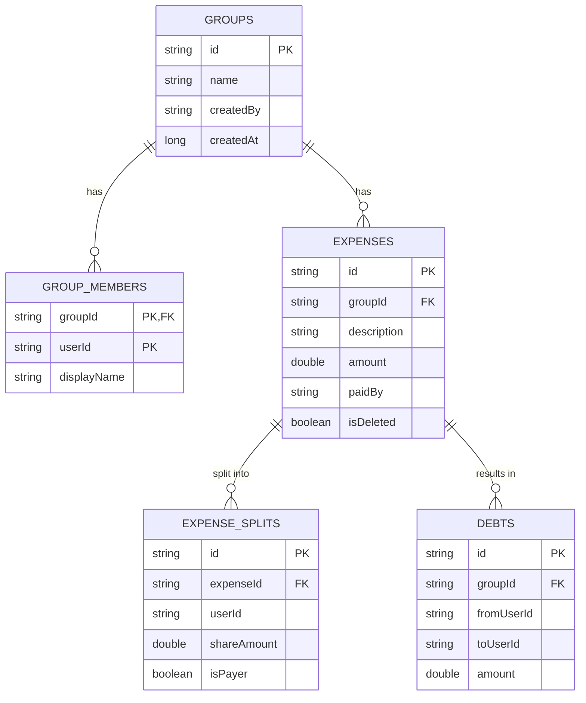

# Splitwise POC Plan

## Overview

Create a proof-of-concept Android app for managing shared expenses with **dual sync strategies**: Firebase (internet) and P2P (local).

## Goals

- **Core Features**: Groups, expenses, automated balance calculation
- **Local-First**: Works offline, Room database as source of truth
- **Dual Sync**: Choose Firebase (internet) or P2P (nearby devices)
- **Conflict Resolution**: Event sourcing with last-write-wins

## Build Variants

| Variant | Sync Method | Setup Required | Best For |
|---------|-------------|----------------|----------|
| **Firebase** | Realtime Database | Firebase project | Remote teams |
| **P2P** | Nearby Connections | None | Local groups |

Build commands:
```bash
./gradlew assembleFirebaseDebug  # Internet sync
./gradlew assembleP2pDebug       # Local sync (no setup!)
```

## Architecture

### Layers

```
UI (Compose) → Domain (Use Cases) → Data (Room + SyncManager)
                                            ↓
                                  Firebase OR P2P
```

### Key Design Decisions

**Local-First**:
- All operations work offline
- Room DB is single source of truth
- Sync is eventual consistency overlay

**Event Sourcing**:
- Immutable event log
- Events never deleted/modified
- Replay events to rebuild state
- Enables conflict-free sync

**Abstraction**:
- `SyncManager` interface
- Hilt DI provides variant-specific impl
- Same codebase, different builds

### Dependency Injection Strategy
To support dual variants without code duplication or runtime checks:

1.  **Interface**: `SyncManager` defined in `app/src/main/java/.../data/sync/`
2.  **Module**: `SyncModule` (Abstract) in `app/src/main/java/.../di/`
3.  **Implementations**:
    *   `P2PSyncManager` in `app/src/p2p/java/.../data/sync/`
    *   `FirebaseSyncManager` in `app/src/firebase/java/.../data/sync/`
4.  **Wiring**:
    *   `P2PSyncModule` in `app/src/p2p/java/.../di/` installs in `SingletonComponent` and provides `P2PSyncManager` as `SyncManager`.
    *   `FirebaseSyncModule` in `app/src/firebase/java/.../di/` does the same for Firebase.

This ensures strict separation and compile-time safety.

## Implementation Phases

### Phase 1: Data Layer (Shared)
1. Room entities with UUIDs
2. DAOs with Room queries
3. Domain models
4. Event models (`SyncEvent`, `SyncState`)

**Entities**:
- `GroupEntity`: id, name, createdBy, createdAt
- `ExpenseEntity`: id, groupId, description, amount, paidBy, timestamps, isDeleted
- `ExpenseSplitEntity`: id, expenseId, userId, shareAmount, isPayer (normalized table, not JSON)
- `GroupMemberEntity`: groupId, userId, displayName
- `DebtEntity`: id, groupId, fromUserId, toUserId, amount
- `ProcessedEventEntity`: eventId, groupId (for idempotency)

> **Why separate `ExpenseSplitEntity`?**  
> SQL queries like `SELECT * FROM expense_splits WHERE userId = ?` are much faster than parsing JSON. Also provides referential integrity.

### Phase 2: Sync Abstraction
1. `SyncManager` interface
2. Common sync models (`SyncEvent`)
3. **Granular `SyncState`** - state machine with 7 states:
   - Disconnected, Advertising, Discovering, Authenticating, Syncing, UpToDate, Error
4. `SyncStateManager` for UI feedback

**Why granular states?**  
Better UX: "Looking for peers..." vs "Not syncing". Users know WHY sync isn't working.

```kotlin
interface SyncManager {
    suspend fun initialize()
    suspend fun getCurrentUserId(): String
    suspend fun createGroup(groupId: String, name: String)
    suspend fun joinGroup(groupCode: String): Result<Unit>
    suspend fun pushEvent(groupId: String, event: SyncEvent)
    fun startListening(groupId: String, onEvent: (SyncEvent) -> Unit)
    val syncState: StateFlow<SyncState>
}
```

### Phase 3: P2P Variant (Recommend First)
Why first: No external setup, faster iteration

**Implementation**:
- `P2PSyncManagerImpl`
- `HybridClockManager` (solves clock skew)
- Nearby Connections API
- Advertise/Discover flow
- Connection approval dialog (security)
- Payload exchange

**User Flow**:
1. Device A creates group → advertises
2. Device B discovers → requests connection
3. Device A shows approval dialog: "Device 'B' wants to join. Allow?"
4. Device A approves → devices exchange events via WiFi Direct/Bluetooth

**P2P Topology & Security**:
- **Topology**: `Strategy.P2P_CLUSTER` (mesh) - any peer can sync with any peer, no central host
- **Encryption**: ENCRYPTION_REQUIRED (UKEY2 protocol) - automatic, no configuration needed
- **Range**: WiFi Direct (~100m) or Bluetooth (~10m)

**Hybrid Clock** (solves clock skew problem):
```kotlin
data class HybridTimestamp(
    val wallClock: Long,      // System time
    val logicalCounter: Int,  // Increments on conflicts
    val nodeId: String        // Tiebreaker
)
```
Ordering: `(wallClock, logicalCounter, nodeId)` ensures causal consistency even if device clocks are wrong.

### Phase 4: Firebase Variant
**Implementation**:
- `FirebaseSyncManagerImpl`
- `FirebaseAuthManager` (anonymous)
- Firebase Realtime Database structure

**Firebase Structure**:
```
/groups/{groupId}
  /metadata: {name, createdBy, createdAt}
  /members: {userId: true}
  /events/{eventId}: {type, userId, timestamp, data}
```

### Phase 5: Repository Layer
1. `GroupRepository` - group CRUD + sync
2. `ExpenseRepository` - expense CRUD + sync
3. `BalanceRepository` - debt calculation

**Pattern**:
```kotlin
suspend fun addExpense(expense: Expense) {
    // 1. Save to Room
    expenseDao.insert(expense.toEntity())
    
    // 2. Push event
    syncManager.pushEvent(expense.groupId, SyncEvent(
        type = EventType.EXPENSE_ADD,
        data = expense.toMap()
    ))
}
```

### Phase 6: Domain Layer
1. Use cases: `CreateGroupUseCase`, `AddExpenseUseCase`, etc.
2. Business logic: debt calculation, split logic
3. Domain models

### Phase 7: UI Layer
**Screens**:
- `GroupListScreen`: Show all groups
- `GroupDetailsScreen`: Expenses + members
- `AddExpenseScreen`: Add/edit expenses
- `BalancesScreen`: Who owes whom

**Components**:
- `SyncStatusBanner`: Show sync progress
- `GroupCodeDialog`: Share/join groups
- `ExpenseCard`: Display expense

### Phase 8: Advanced Features
1. **Data Portability**: `GroupExporter` for cross-variant migration
   - Export group as JSON event log
   - Export group as JSON event log
   - Import into other variant (P2P → Firebase or vice versa)
   - **Conflict Handling**: If importing a group that already exists locally:
     - **Strategy**: Reject and warn user (POC simplicity)
     - **Future**: Merge events and resolve duplicates via event IDs
2. **User Identity**: `UserIdManager` - persist user ID in SharedPreferences
3. **P2P Security**: Connection approval dialog
4. **Snapshots** (optional): `SnapshotManager` for performance
   - Snapshot every 100 events
   - Load snapshot + replay deltas instead of all events
5. Testing & Polish
6. **Error Handling & Retry Policy**
   - **Firebase**: Implement `ExponentialBackoff` for event pushing (initial 500ms, max 30s).
   - **P2P**: Auto-reconnect on stream failure.
   - **UI**: Show "Retrying..." state instead of immediate failure.
7. Sync status UI with granular states

## Testing Plan

### Unit Testing Strategy (Critical)
Because distributed systems are hard to debug, we rely on unit tests for core logic:

1.  **`HybridClockManagerTest`**:
    - Verify `tick()` increments logical counter only when wall clocks match.
    - Verify `update()` correctly merges remote timestamps (max(local, remote)).
2.  **`SyncEventTest`**:
    - Verify `Comparator` correctly orders events by `(wallClock, logicalCounter, nodeId)`.
3.  **`ExpenseSplitTest`**:
    - Verify debt calculation logic (pure function) covers edge cases (rounding, single payer, multiple payers).

### Manual Test 1: Firebase - Remote Sync
**Setup**: 2 devices, different networks

1. Device A creates group, gets code
2. Device B joins using code
3. Device A adds expense
4. Verify appears on B within 2 seconds
5. Device B adds expense
6. Verify appears on A

### Manual Test 2: P2P - Local Sync
**Setup**: 2 devices, same room

1. Device A creates group
2. Device B discovers and connects
3. Device A adds expense
4. Verify instant sync to B

### Manual Test 3: Offline Conflicts
**Setup**: Both offline

1. Enable airplane mode
2. Device A edits "Lunch $20" → "$25"
3. Device B edits "Lunch $20" → "$30"
4. Disable airplane mode
5. Verify convergence (latest wins)

### Manual Test 4: Performance
**Goal**: 100 expenses < 10 seconds to sync

1. Generate 100 test expenses
2. Measure initial sync time
3. Add 1 expense
4. Measure incremental sync < 1 second

## Database Schema



## Technology Decisions

### Why Kotlin?
- Google recommended for Android
- Coroutines for async
- Null safety

### Why Compose?
- Modern declarative UI
- Less boilerplate
- Better state management

### Why Room?
- Type-safe SQL
- Compile-time verification
- Flow integration

### Why Hilt?
- Official DI for Android
- Scopes and lifecycle awareness

### Why Event Sourcing?
- Conflict-free sync
- Audit trail
- Easy to reason about

### Why Dual Variants?
- Flexibility: internet vs local
- Privacy: P2P keeps data local
- Accessibility: P2P needs no setup

## Production-Ready Improvements

These 7 improvements distinguish this POC from a toy app:

### 1. Database Normalization
❌ **Bad**: `splitAmong` as JSON string in `ExpenseEntity`  
✅ **Good**: Separate `ExpenseSplitEntity` table

**Benefits**:
- Fast SQL queries: `SELECT * FROM expense_splits WHERE userId = ?`
- Referential integrity via foreign keys
- Better indexing and JOINs

### 2. Clock Skew Solution (P2P)
❌ **Bad**: Wall clock timestamps (Device A 5 min behind = always loses)  
✅ **Good**: Hybrid Logical Clocks

**Benefits**:
- Causal consistency without centralized server
- Respects real causality, not just wall clock
- Firebase variant still uses server timestamps (simpler)

### 3. User Identity Persistence
❌ **Bad**: Generate new UUID each app launch  
✅ **Good**: `UserIdManager` persists to SharedPreferences

**Benefits**:
- User ID survives app restarts
- No lost "paid by" credits on reinstall
- Critical for multi-session usage

### 4. P2P Connection Security
❌ **Bad**: Auto-accept any nearby device  
✅ **Good**: Show approval dialog before accepting

**Benefits**:
- Prevents malicious devices from silently joining
- User controls who can modify their data
- Simple security layer: "Device 'X' wants to join. Allow?"

### 5. P2P Topology & Encryption
❌ **Bad**: Unspecified topology, unclear security  
✅ **Good**: `P2P_CLUSTER` mesh with UKEY2 encryption

**Benefits**:
- Mesh topology: any peer syncs with any peer (no central host)
- UKEY2: authenticated encryption (automatic)
- Decentralized and secure

### 6. Granular Sync States
❌ **Bad**: Boolean `isSyncing` flag  
✅ **Good**: State machine with 7 states

**Benefits**:
- Better UX: "Looking for peers..." vs "Not syncing"
- Troubleshooting: user knows WHY sync isn't working
- States: Disconnected, Advertising, Discovering, Authenticating, Syncing, UpToDate, Error

### 7. Cross-Variant Migration
❌ **Bad**: Locked into P2P or Firebase forever  
✅ **Good**: Export/import groups between variants

**Benefits**:
- Start with P2P (no setup) → migrate to Firebase later
- Camping trip (P2P) → city life (Firebase)
- Event sourcing makes this trivial (JSON export)

**Bonus (Optional): Event Log Snapshots**
- Performance optimization for long-lived groups
- Snapshot every 100 events, replay only deltas
- 1000 events: 2-3s → 200ms load time
- Recommended for production, optional for POC

---

## Conflict Resolution Strategy


**Approach**: Event Sourcing + Variant-Specific Timestamps

### Firebase Variant: Server Timestamps (Simple)
Firebase's `ServerValue.TIMESTAMP` provides a trusted, centralized time source.

### P2P Variant: Hybrid Logical Clocks (Complex)
**Problem**: No central server, device clocks can be wrong (clock skew).

**Solution**: Hybrid Logical Clocks (HLC)
- Combine wall clock + logical counter + node ID
- Ordering: `(wallClock, logicalCounter, nodeId)`
- Updates on both sending and receiving events
- Ensures causal consistency even with clock skew

**Rules (Both Variants)**:
1. Events are immutable and timestamped
2. Events applied in timestamp order
3. For edits, latest timestamp wins
4. Deletes use tombstone pattern (isDeleted=true)
5. Idempotency via processed event tracking

**Example (P2P with clock skew)**:
```
Device A clock: 10:00 AM (5 min behind)
Device B clock: 10:05 AM (correct)

T0: A edits expense → HLC(10:00, 0, nodeA)
T1: B edits expense → HLC(10:05, 0, nodeB)
T2: A receives B's event → updates own HLC to (10:05, 1, nodeA)

Resolution: B wins (10:05, 0) > (10:00, 0)
But A's next edit gets (10:05, 1+) which sequences correctly
```

## File Structure

```
app/src/
├── main/java/com/example/splitwise/
│   ├── data/
│   │   ├── local/           # Room (entities, DAOs, database)
│   │   ├── sync/            # SyncManager interface + models
│   │   └── repository/      # Repositories
│   ├── domain/              # Use cases + domain models
│   ├── ui/                  # Compose screens + components
│   ├── viewmodel/           # ViewModels
│   └── di/                  # Hilt modules
├── firebase/
│   └── java/.../data/sync/  # FirebaseSyncManagerImpl
└── p2p/
    └── java/.../data/sync/  # P2PSyncManagerImpl
```

## Dependencies

**Shared**:
- Compose, Room, Hilt, Coroutines, Kotlinx Serialization

**Firebase variant only**:
- `firebase-database-ktx`, `firebase-auth-ktx`

**P2P variant only**:
- `play-services-nearby`

## Next Steps

1. Set up build variants in `build.gradle`
2. Create Room database schema
3. Implement `SyncManager` interface
4. Build P2P variant (faster testing)
5. Build Firebase variant
6. Create repositories
7. Build UI
8. Test and iterate

## Success Criteria

- [ ] Can create groups and add expenses
- [ ] Balances calculate correctly
- [ ] P2P variant syncs when nearby
- [ ] Firebase variant syncs over internet
- [ ] Offline conflicts resolve correctly
- [ ] UI shows sync status
- [ ] 100 expenses sync in < 10 seconds

## Future Enhancements

- Custom split ratios (not just equal)
- Settlement suggestions
- Push notifications (Firebase)
- QR codes for P2P joining
- Export to CSV
- Group chat

---

**For detailed implementation specs, see**: `implementation_plan.md` in `.gemini/antigravity/brain/`
