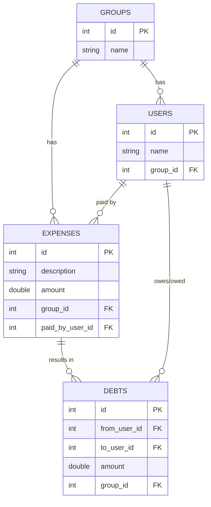
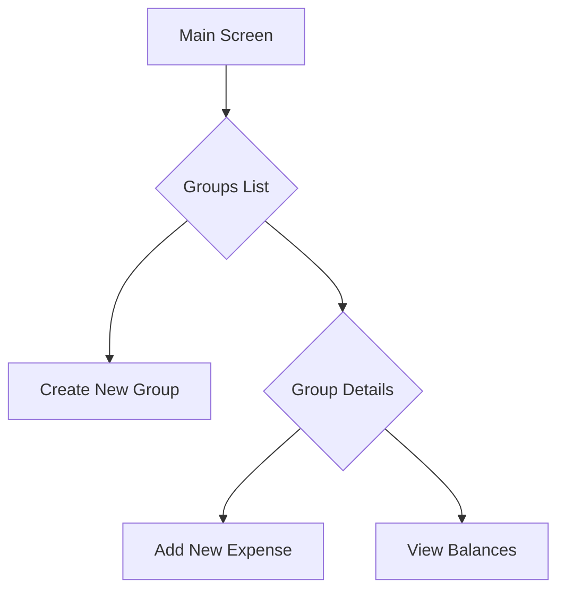
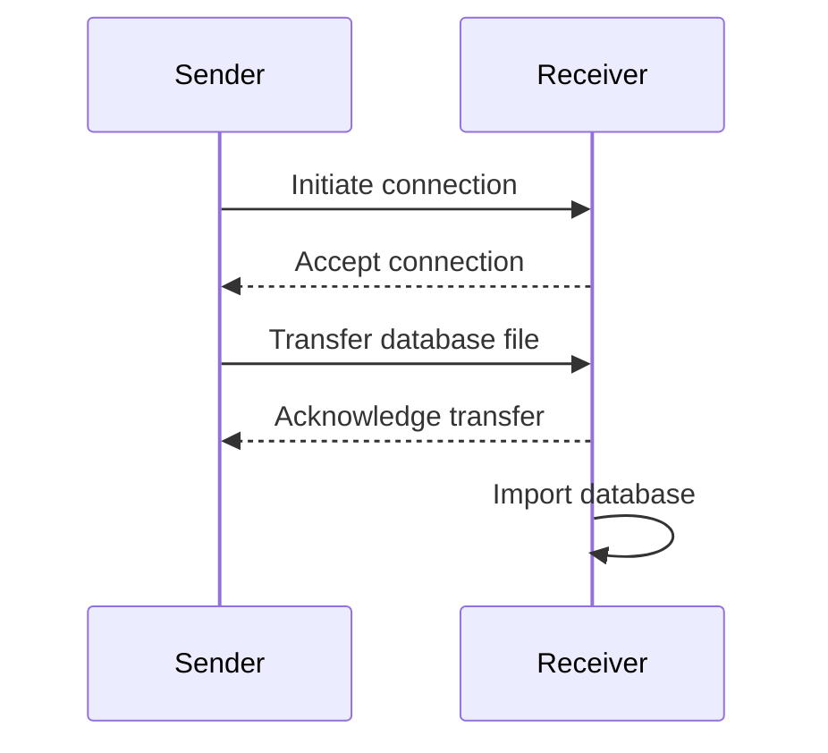

# Splitwise POC Plan

This document outlines the plan for creating a proof-of-concept Android application that replicates the core functionality of Splitwise, with a focus on local data storage and simple peer-to-peer synchronization.

## Project Overview

The goal of this project is to create a simple, local-first Android application for managing shared expenses. The application will allow users to create groups, add expenses, and track balances. It will also feature a simple peer-to-peer synchronization mechanism to share the expense data between devices.

## Technology Stack

*   **Programming Language:** Kotlin
*   **UI Toolkit:** Jetpack Compose
*   **Database:** Room Persistence Library (SQLite)
*   **P2P Transfer:** Android's Wi-Fi Direct or Bluetooth APIs

## Part 1: Core Application Development (Local First)

### 1. Setup Development Environment

*   **Install Android Studio:** Download and install the latest version of Android Studio from the official website.
*   **Configure for Kotlin:** Ensure that the Kotlin plugin is enabled in Android Studio.
*   **New Project:** Create a new Android Studio project with the "Empty Compose Activity" template.
*   **Dependencies:** Add the necessary dependencies for Room and Jetpack Compose to the `build.gradle` file.

### 2. Database Schema

The application will use a simple SQLite database to store the data. The schema will be implemented using Room entities.

### 3. User Interface (UI)

The UI will be built using Jetpack Compose and will follow Material Design principles.

*   **Main Screen:** A list of all groups.
*   **Create New Group:** A dialog or screen to create a new group.
*   **Group Details:** A screen that shows the expenses and balances for a specific group.
*   **Add New Expense:** A form to add a new expense to a group.
*   **View Balances:** A screen that shows who owes whom within the group.

### 4. Business Logic

The core business logic will be implemented in Kotlin.

*   **Expense Splitting:** For the POC, we will implement a simple "split equally" logic. When an expense is added, the application will create or update the `DEBTS` table to reflect the new balances.
*   **Debt Calculation:** The application will calculate the final balances by aggregating the debts between users.

## Part 2: Simple Peer-to-Peer Synchronization

### 1. Database Export/Import

*   **Export:** The application will have a feature to export the entire SQLite database file to a publicly accessible folder on the device's storage.
*   **Import:** The application will have a feature to import a database file from the device's storage, replacing the existing database.

### 2. Peer-to-Peer Transfer

The application will use Android's Wi-Fi Direct or Bluetooth APIs to transfer the database file between devices.

*   **Sender:** The user on the sending device will initiate the transfer. The application will export the database and send it to the receiver.
*   **Receiver:** The user on the receiving device will accept the transfer. The application will receive the database file and import it, overwriting the local data.

## Conclusion

This plan outlines the steps to create a functional proof-of-concept of a Splitwise-like application. The focus is on creating a simple, local-first application with a basic peer-to-peer synchronization mechanism. Future improvements could include more advanced expense splitting options, cloud synchronization, and a more robust P2P sync solution.
